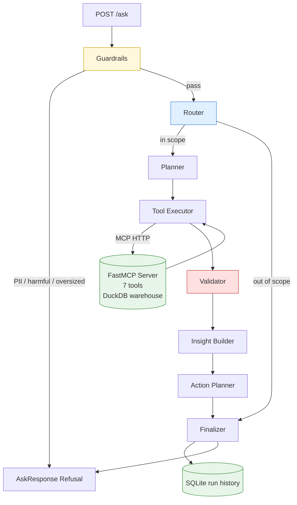
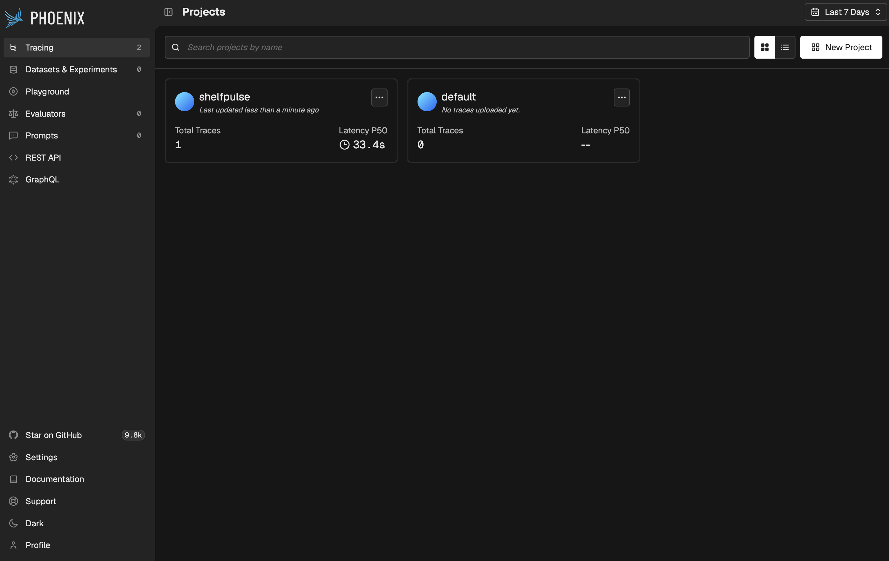
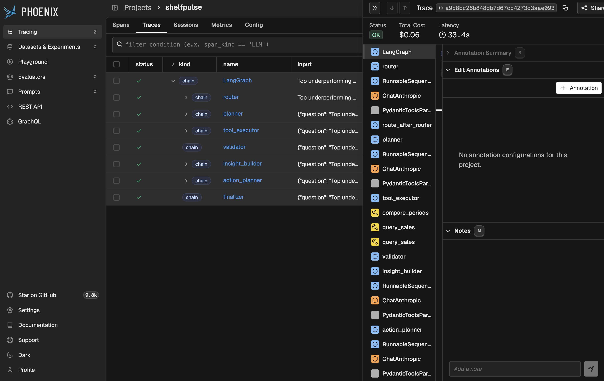
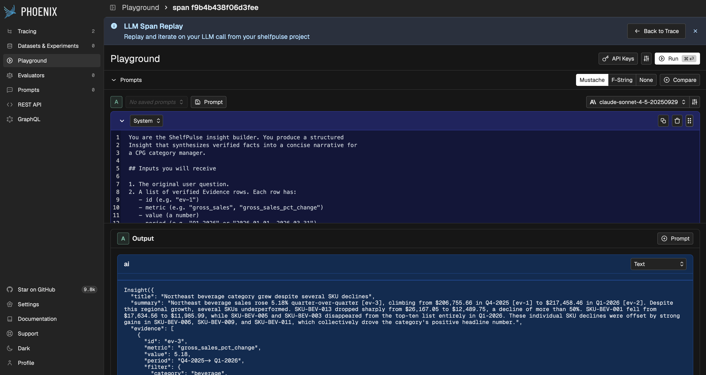

# ShelfPulse

A LangGraph-powered CPG sales-insight agent. Plain-English questions in, structured KPI snapshots, evidence-cited insights, and ranked action plans out. Built to demonstrate production-grade LLM engineering: typed I/O, structural hallucination prevention, observability, and a real evaluation harness.



## What is interesting about the architecture

**Evidence is materialized before the insight is written.** The validator node converts raw tool results into a typed `Evidence` list with stable IDs, and the insight builder is constrained to cite only those IDs. Hallucination of metric values becomes structurally impossible: an aggregate number cannot appear in the summary unless a real tool call produced it.

**Tools live behind an MCP server, not inline functions.** The agent talks to FastMCP over HTTP. The same MCP server could serve a Claude desktop user or a teammate's agent without code changes. The catalog has 7 tools across products, regions, channels, sales aggregates, period comparisons, and stockout risk.

**Every LLM call is structured.** `with_structured_output(SomeModel)` at every node. Pydantic catches malformed responses at the boundary; the graph never proceeds with invalid intermediate state.

**Every request is traced.** OpenInference auto-instrumentation produces an OTEL span tree per request, viewed in Arize Phoenix. Token counts, latency, and prompts/completions visible per span.

## Quickstart

```bash
git clone <repo-url>
cd shelfpulse
uv sync
cp .env.example .env       # add your ANTHROPIC_API_KEY

# Seed the warehouse (~50k rows of synthetic CPG sales)
uv run python data/seed.py

# Terminal 1: MCP server (DuckDB + 7 tools)
uv run python -m mcp_server.server

# Terminal 2: API + agent + Phoenix
uv run uvicorn api.main:app --port 8000

# Terminal 3: try a question
curl -s -X POST http://localhost:8000/ask \
  -H "Content-Type: application/json" \
  -d '{"question": "Top underperforming beverage SKUs in Northeast last quarter"}'
```

Phoenix UI is at http://localhost:6006 once the API is up.

## Demo scenarios

### 1. Comparison plus root cause
> *"Top underperforming beverage SKUs in Northeast last quarter vs the one before."*

Plan: one `compare_periods` at category level, two `query_sales` for per-SKU drill-down across both quarters. Insight cites three Evidence rows (Q4-2025 value, Q1-2026 value, percentage change). Action plan ranks five recommendations across `assortment`, `distribution`, `promo`, `price`, and `supply` levers.

### 2. Promo sustainability
> *"Promo lift on snacks over the last 8 weeks. Is it sustainable?"*

Plan: two `compute_kpi` calls comparing the recent 8-week window to the prior 8-week window. Returns 14 Evidence rows across both periods. The insight identifies promo-share trend and recommends reallocation across `promo` and `assortment` levers.

### 3. Out of scope refusal
> *"What's the weather in Chicago?"*

The router classifies as out of scope; the graph short-circuits to the finalizer. A structured `RefusalResponse` is returned with a fresh `trace_id` for audit. No planner, no tools, no insight LLM call. Sub-1-second latency.

## Evaluation

The eval harness in `eval/` runs 10 canned questions against the live `/ask` endpoint and grades each response against expected facts using substring and structural checks. Six in-scope analytics questions of varying complexity plus four refusal questions covering PII, prompt injection, and out-of-scope.

```bash
uv run python eval/run_eval.py
```

Latest run: **9 of 10 passed.**

| id  | result | latency | coverage |
|-----|--------|---------|----------|
| q1  | PASS   | 70.6s   | beverage period comparison with per-SKU drill |
| q2  | PASS   | 45.9s   | snack promo sustainability over 8 weeks |
| q3  | PASS   | 21.1s   | stockout risk on 30-day horizon |
| q4  | PASS   | 45.9s   | channel comparison on energy gross sales |
| q5  | FAIL   | 22.6s   | region ranking by gross margin |
| q6  | PASS   | 28.5s   | top SKUs by velocity, restock recommendation |
| q7  | PASS   | 2.6s    | out_of_scope refusal (weather) |
| q8  | PASS   | 0.0s    | pii guardrail (credit card) |
| q9  | PASS   | 0.0s    | harmful guardrail (prompt injection) |
| q10 | PASS   | 2.7s    | out_of_scope refusal (joke) |

### Why q5 fails (honest)

q5 asks for the region with the highest gross margin on beverages in Q1 2026. To answer rigorously, the planner needs to fan out one `compute_kpi` call per region (12 calls), then compare. The current planner picks a single aggregate call instead, so the validator has nothing per-region to materialize as `Evidence` and the eval flags the empty list. The insight body itself is well-formed and probably correct; the rigor gap is in the plan, not the execution.

Two fixes for a v2:

1. **Smarter planner** that emits fan-out plans for ranking questions ("which X has the highest Y" pattern).
2. **A new MCP tool** like `rank_by_metric(metric, group_by_dimension)` that pushes the fan-out to the data layer where it belongs.

The eval is intentionally shallow (surface properties, refusal coverage, lever distribution). A v2 would add LLM-as-judge scoring on insight quality and a golden-set regression on numeric claims.

## Observability

Every request produces an OTEL span tree visible in Arize Phoenix at http://localhost:6006.



*Phoenix Projects view showing the shelfpulse project with traced requests. Total Traces and P50 Latency are visible at a glance.*



*A single /ask request expanded into nested spans. Each agent node (router, planner, tool_executor, validator, insight_builder, action_planner, finalizer) gets its own span, and the MCP tool calls (compare_periods, query_sales) appear as child spans under tool_executor. Total cost and latency surfaced for the whole trace.*



*Phoenix's LLM Span Replay view. Any LLM call can be replayed with its original system prompt, input, and observed output. Sufficient to debug a misbehaving node without printf-style logging, and useful for iterating on prompts directly against captured traces.*

## Tech stack

- **Python 3.12** with `uv` for package management
- **FastAPI** for the HTTP layer
- **LangGraph** for the 7-node agent (router, planner, tool executor, validator, insight builder, action planner, finalizer)
- **Anthropic Claude Sonnet 4.5** via `langchain-anthropic`, with `with_structured_output` at every node
- **FastMCP** server exposing 7 tools over HTTP
- **DuckDB** for the synthetic warehouse (~50k rows)
- **SQLite** for run history and replay
- **Pydantic v2** for structured outputs and request/response schemas
- **Arize Phoenix** plus **OpenInference** for OTEL tracing
- **`httpx`** for the eval harness

## Repository layout

```
shelfpulse/
├── data/                  # schema.sql, seed.py
├── warehouse/             # shelfpulse.duckdb, runs.sqlite (gitignored)
├── mcp_server/            # FastMCP entry point + 7 tools + Pydantic models
├── agent/
│   ├── graph.py           # build_graph() wires every node
│   ├── state.py           # AgentState TypedDict
│   ├── llm.py             # shared ChatAnthropic factory
│   ├── guardrails.py      # input checks (PII, harmful, oversized)
│   ├── observability.py   # Phoenix bootstrap
│   ├── tool_client.py     # MCP client wrapper plus unwrap_result helper
│   ├── nodes/             # one file per node
│   └── prompts/           # system prompts for router, planner, insight, action
├── api/
│   ├── main.py            # FastAPI app with /ask, /insights, /actions, /healthz
│   ├── schemas.py         # request/response Pydantic models
│   └── storage.py         # SQLite run persistence
├── eval/
│   ├── questions.jsonl    # 10 canned questions with expected facts
│   └── run_eval.py        # grader and table printer
└── docs/                  # Phoenix screenshots
```

## Design choices worth calling out

**The validator is the differentiator.** Most LLM agents catch hallucination after the fact. ShelfPulse makes it structurally impossible: every aggregate number cited in an insight must come from a typed `Evidence` row produced by a real tool call. The validator builds that evidence list before the insight LLM runs.

**Tools are MCP, not inline.** The FastMCP server is a separate process. The same server could host a Claude desktop user, a teammate's agent, or a CLI client. The agent is one consumer, not the only consumer.

**Conservative guardrails at the boundary.** PII and prompt-injection are caught by regex before any LLM call. The router catches off-scope semantics with a single cheap LLM call. Both stages refuse with the same structured `RefusalResponse`, distinguishable by reason code.

**The action planner has Pydantic-enforced shape.** Ranks must be sequential from 1, impact ranges must satisfy `high >= low`, evidence references must match the `ev-N` pattern. The LLM cannot produce a malformed action plan even if it tries.

## What's not built

- **Retry loop on the validator.** The scaffolding is there (`retry_count` in state, planner accepts feedback) but the conditional edge from validator back to planner isn't wired. A v2 would add cross-validation via redundant `compute_kpi` calls and retry on mismatch.
- **Fan-out planning.** Ranking questions ("which X has the highest Y") need the planner to emit one tool call per option. q5 in the eval suite documents this limit. A v2 adds either smarter planning or a `rank_by_metric` MCP tool.
- **Streaming response.** `/ask` is synchronous. `/ask/stream` via SSE is plumbed in the schemas but not implemented.
- **Authentication.** Single-tenant local demo. Production would add API key auth and row-level security at the warehouse, not in the agent.

## License and authorship

Built by Joseph Aguilar Feener.
